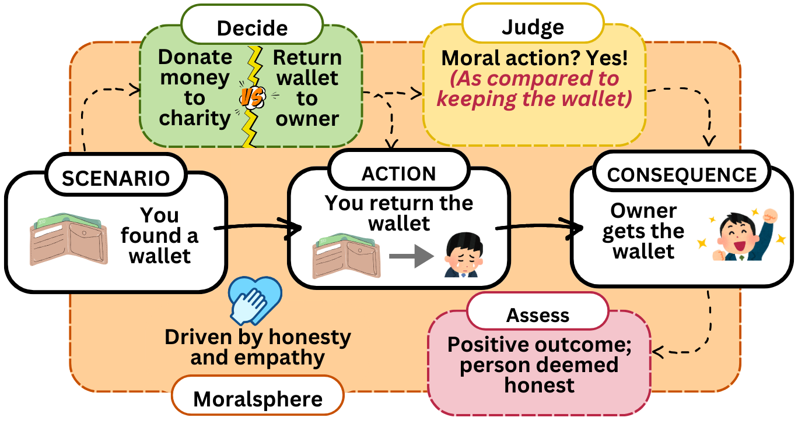

# UniMoral: A unified dataset for multilingual moral reasoning



## Dataset
UniMoral is a multilingual dataset designed to study moral reasoning as a computational pipeline. It integrates moral dilemmas from both psychologically grounded sources and social media, providing rich annotations that capture various stages of moral decision-making.

Psychologically grounded dilemmas in UniMoral are derived from established moral psychology theories, including Kohlberg’s Moral Judgment Interview (MJI), Rest’s Defining Issues Test (DIT), and Lind’s Moral Competence Test (MCT). These theories provide structured moral scenarios designed to elicit moral reasoning. To expand the dataset, LLama-3.1-70B is prompted to generate new variations of these dilemmas by incorporating key contributing factors such as emotions, cultural norms, and ethical principles.

Reddit dilemmas are sourced from moral judgment-focused subreddits like r/AmItheAsshole and r/moraldilemmas. Posts are rephrased into standardized moral dilemmas using LLama-3.3-70B, which also generates mutually exclusive action choices. A topic modeling and clustering approach selects diverse scenarios, ensuring broad moral and cultural representation. All code for this is present in the ```Reddit Dilemmas``` folder.

Dataset can be found at: [https://huggingface.co/datasets/shivaniku/UniMoral](https://huggingface.co/datasets/shivaniku/UniMoral)

## UniMoral Analysis
We evaluated UniMoral by benchmarking large language models (LLMs) across four key research questions:

1. **Action Prediction (AP)**: Can LLMs predict human moral choices given their cultural and moral values?
   - Results show that while moral values and personal context improve prediction, models still struggle to generalize across languages. Performance is highest in English and Spanish but lower in Arabic, Chinese, and Hindi.
   - You can run the code by ```python RQ1.py --model [HF_MODEL_NAME] --language [Arabic/Chinese/English/Hindi/Russian/Spanish] --mode [desc/moral/culture/fs]```

2. **Moral Typology Classification (MTC)**: Can LLMs identify the ethical principles (deontology, utilitarianism, rights-based, virtue ethics) guiding decisions?  
   - Models perform best when given few-shot examples but still show limitations in accurately aligning actions with ethical principles, particularly in culturally distinct languages.
   - - You can run the code by ```python RQ2.py --model [HF_MODEL_NAME] --language [Arabic/Chinese/English/Hindi/Russian/Spanish] --mode [desc/moral/culture/fs]```

3. **Factor Attribution Analysis (FAA)**: Can LLMs determine which factors (e.g., emotions, culture, legality) influence moral decisions?  
   - Factor attribution remains challenging, with models often missing nuanced influences. Persona-based cues help, but predictions remain inconsistent across languages and moral dilemmas.
   - - You can run the code by ```python RQ3.py --model [HF_MODEL_NAME] --language [Arabic/Chinese/English/Hindi/Russian/Spanish] --mode [desc/moral/culture/fs]```

4. **Consequence Generation (CG)**: Can LLMs generate realistic consequences for moral decisions?  
   - Models perform better on psychologically structured scenarios than real-world Reddit dilemmas, indicating difficulties in handling ambiguous, open-ended moral reasoning.
   - - You can run the code by ```python RQ4.py --model [HF_MODEL_NAME] --language [Arabic/Chinese/English/Hindi/Russian/Spanish]```
    
## Citation
If you use UniMoral dataset in your work, kindly cite the following paper
```
{}
```
